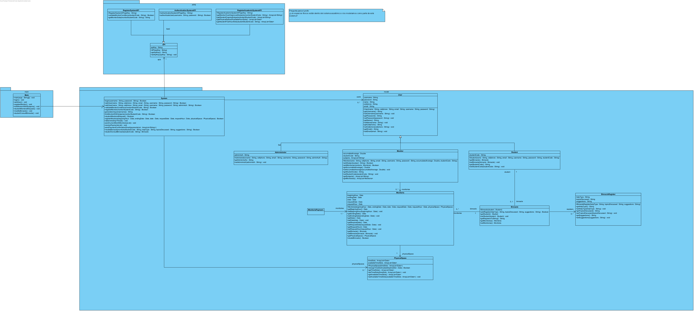

## Integrantes Equipo #4:

- Yuluka Gigante Muriel 

- Santiago Barraza 

- Sebastián Lopez

---

# Tabla de contenidos
1. [Generalidades del proyecto](#caso-de-monitores)
	1. [Contexto](#contexto)
	2. [Enunciado](#enunciado)
2. [Especificación de requerimientos](#especificación-de-requerimientos)
3. [Diagrama de Clases](#diagrama-de-clases)
4. [Diagrama de casos de uso](#diagrama-de-casos-de-uso)
5. [Formato bicolumnar](#formato-bicolumnar)
6. [Diagrama de secuencia](#diagrama-de-secuencia)

---
# Caso de monitores
## Contexto
El presente repositorio almacena la documentación y diseño de un sistema de gestión de monitorias para la Universidad Icesi. 

La documentación y diseño consiste de: Especificación de requerimientos usando método de Dorfman, Diagrama de clases en UML, Diagrama de casos de uso en UML, formato bicolumnar para cada caso de uso, y Diagrama de secuencias en UML.

## Enunciado
El enunciado que plantea el problema al que le daremos solución es el siguiente: [Enunciado](doc/Enunciado.pdf).

# Especificación de requerimientos
El documento de especificación de requerimientos lo hemos hecho usando el método de Dorfman.

El documento es el siguiente:

[Dorfman](doc/Dorfman.pdf)

# Diagrama de Clases
El diagrama de clases de nuestra solución es el siguiente:

[Enlace al pdf](doc/ClassDiagram.pdf)

# Diagrama de casos de uso

# Formato bicolumnar

# Diagrama de secuencia